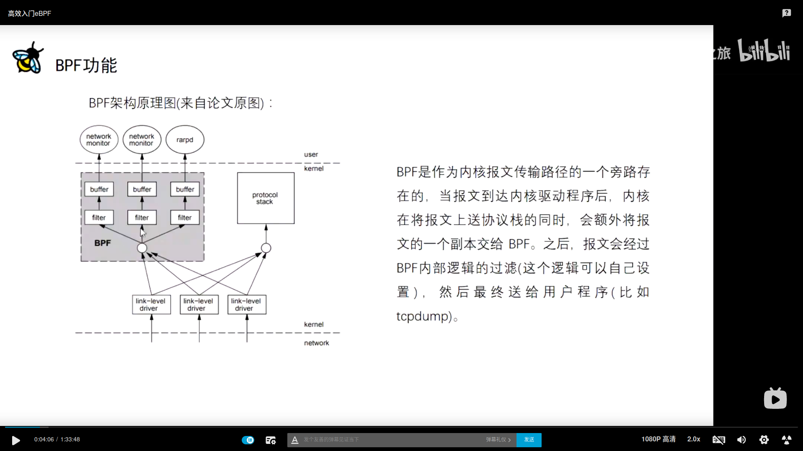
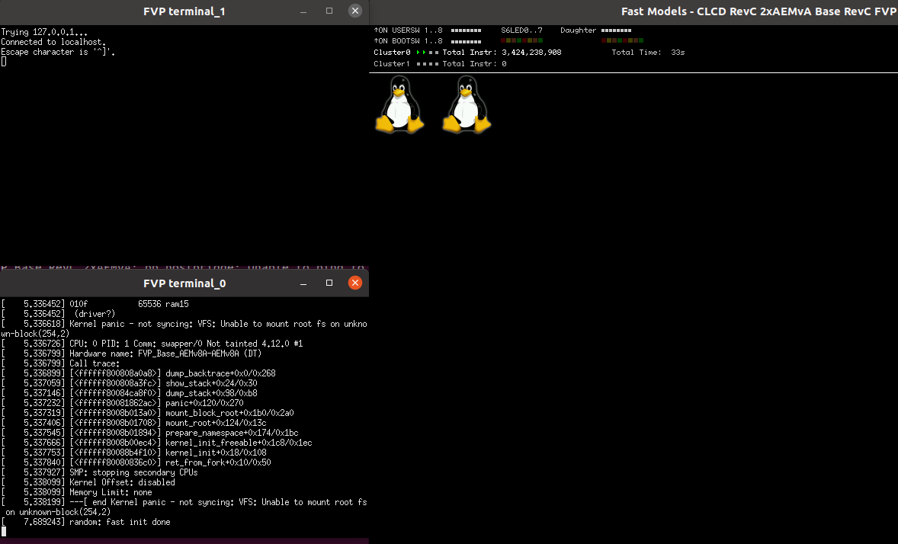

#日常记录
## ubuntu
  * 输入法
   默认安装的vs code（sudo snap install code ）不支持中文输入法。
   > 到ubuntu官网下载，直接打开提示不支持。然后通过sudo apt install code_xxx_amd64.deb后ok
  * 画图
  默认没有提供一个好用的画图软件，比如在截图时需要编辑
  > sudo snap install xpaint

## firefox
* 自带的firefox浏览器打开bilibili视频，提示未安装flash 插件，目前使用的方案是
`sudo apt install ubuntu-restricted-extras`

## markdown
* 语法
  参考markdown官网的默认[**编辑器**](https://markdown.com.cn/editor/)


## bcc
* 安装
  按照[bcc](https://github.com/iovisor/bcc)的Install.md文档中的 [Ubuntu - Source](https://github.com/iovisor/bcc/blob/master/INSTALL.md)章节的第二个make处提示ModuleNotFoundError:No module named 'distutils.core’。
```shell
git clone https://github.com/iovisor/bcc.git
mkdir bcc/build; cd bcc/build
cmake ..
make
sudo make install
cmake -DPYTHON_CMD=python3 .. # build python3 binding
pushd src/python/
make
sudo make install
popd
```
解决方案是
`sudo apt install python3-distutils`
* 使用
  * python的command安装在/usr/sbin/scripts/bcc目录，当然也可以运行该git仓库中的tools/*.py来执行

* 学习
  * [原理](https://www.bilibili.com/video/BV1LX4y157Gp?from=search&seid=5071888399244289393)
    


  * [使用](https://www.bilibili.com/video/BV1kV411v7GX/?spm_id_from=333.788.recommend_more_video.-1)
  * 

## Linux 内核之旅
1. 模拟器安装
1.1 基于ds5的文档搭建
使用模拟器跑linux，要么使用arm的FVP或者使用qemu-aarch64. 其中我使用了FVP。先是在[arm官网](https://developer.arm.com/tools-and-software/simulation-models/fixed-virtual-platforms?_ga=2.210982998.2119797948.1620036528-707537729.1620036528)下载了FVP，运行时发现是需要license的。关于FVP的license问题在[arm论坛](https://community.arm.com/developer/tools-software/oss-platforms/f/dev-platforms-forum/13531/fvp-license/36693#36693)也有说明FVP有两个版本，
  > FVP_Base_RevC-2xAEMv8A - free to use FVP
  FVP_Base_AEMv8A-AEMv8A - licensed FVP

后来我又下载了free版本的。FVP_Base_RevC-2xAEMvA，其还需要libnomali.so的支持。
然后按照[DS-5-FVP-ARMv8-A](https://github.com/andyshrk/DS-5-FVP-ARMv8-A)的说明，稍微修改以下run.sh，如下
```shell
#!/bin/sh
FVP_Base_RevC-2xAEMvA \
-C bp.secure_memory=0 \
-C cache_state_modelled=0 \
-C bp.pl011_uart0.untimed_fifos=1 \
-C bp.secureflashloader.fname=bl1.bin \
-C bp.flashloader0.fname=fip.bin \
--data cluster0.cpu0=Image@0x80080000 \
--data cluster0.cpu0=fvp-base-aemv8a-aemv8a.dtb@0x82000000 \
--data cluster0.cpu0=ramdisk.img@0x84000000 \
-C bp.ve_sysregs.mmbSiteDefault=0 \
-C bp.virtioblockdevice.image_path=lt-vexpress64-openembedded_lamp-armv8-gcc-4.9_20150912-729.img \
-C bp.smsc_91c111.enabled=true \
-C bp.hostbridge.userNetworking=true \
-C bp.hostbridge.userNetPorts="5555=5555,8080=8080,22=22" \
#--cadi-server
```
运行提示，并且没有串口终端显示
> sh: 1: xterm: not found

然后安装了xterm后ok
`sudo apt install xterm`
显示如图


1.2 基于arm官网的armplat_1810.py。
```shell
administrator@ubuntu:~/github/DS-5-FVP-ARMv8-A/arm$ ./armplat_1810.py --no_check_apt_deps


## Please select a platform:

 1) Development boards               
 2) Fixed Virtual Platforms (FVPs)   

> 2


## Please select a platform:

 1) System Guidance      
 2) Armv8 architecture   

> 2


## Please select a platform:

 1) Armv8-A Base Platform         -- 11.3.30+ (Rev C)
 2) Armv8-A Foundation Platform   -- 11.3.30+

> 2
./armplat_1810.py:739: DeprecationWarning: The 'warn' method is deprecated, use 'warning' instead
  def warn ( msg ): logging.getLogger(__name__).warn (msg)
WARNING: only avail. option is Armv8-A Foundation Platform with 64-bit software stack


## Please specify whether you want to:

 1) Build from source            
 2) Use prebuilt configuration   

> 1


## Please select an environment:

 1) Linux kernel + filesystem   
 2) Firmware only               

> 1


## Please select your kernel:

 1) ack-4.9-armlt   -- Android Common Kernel
 2) latest-armlt    -- 4.17 commit 9b2769768c

> 2


## Please select your filesystem:

 1) BusyBox        -- commit 111cdcf295
 2) OpenEmbedded   -- 15.09

> 2


## Please select your filesystem:

 1) OpenEmbedded LAMP      -- 15.09
 2) OpenEmbedded Minimal   -- 15.09

> 1


## Your chosen configuration is shown below:

    +-------------+--------------------------------------------------------+
    | Workspace   | /home/administrator/github/DS-5-FVP-ARMv8-A/arm/       |
    | Platform    | Armv8-A Foundation Platform with 64-bit software stack |
    | Type        | Build from source                                      |
    | Environment | Linux kernel + filesystem                              |
    | Kernel      | latest-armlt (4.17 commit 9b2769768c)                  |
    | Filesystem  | OpenEmbedded LAMP 15.09                                |
    +-------------+--------------------------------------------------------+

## Proceed with this configuration?:

 1) Yes   
 2) No    

> 1

Fetching and extracting dependencies...

Fetching gcc-linaro-6.2.1-2016.11-x86_64_aarch64-linux-gnu.tar.xz: 93.88 MiB / 93.88 MiB             
Extracting gcc-linaro-6.2.1-2016.11-x86_64_aarch64-linux-gnu.tar.xz...
Fetching gcc-linaro-6.2.1-2016.11-x86_64_arm-linux-gnueabihf.tar.xz: 87.29 MiB / 87.29 MiB           
Extracting gcc-linaro-6.2.1-2016.11-x86_64_arm-linux-gnueabihf.tar.xz...

```

1.3 qemu-system-aarch64

 ```shell
 #安装qemu
 sudo apt install qemu-system-arm
 #执行
 qemu-system-aarch64 -machine virt \
 -cpu cortex-a57 \
 -nographic -m 2048 -smp 2 \
 -kernel ../buildroot/Image.gz \
 -append "console=ttyAMA0 debug user_debug=31 systemd.log_target=null androidboot.hardware=fvpbase rw rootwait loglevel=9" \
 -initrd ../buildroot/rootfs.cpio.gz
 ```


1.4 FVP 替换image
基于buildroot编译，
```shell
make arm_foundationv8_defconfig
make
```
```
ln -s  ../buildroot/output/images buildroot
```

```
# 默认buildroot仅编译root.ext2，但是fvp的uboot却识别不了，通过如下命令制作
sudo apt install mkimage
mkimage -A arm64 -O linux -T ramdisk -C gzip -n "Build Root File System" -d rootfs.ext2 rootfs.ext2.uboot
#对于压缩的rootfs.ext2
mkimage -A arm64 -O linux -T ramdisk -C gzip -n "Build Root File System" -d rootfs.ext2.gz rootfs.ext2.gz.uboot
```
问题是一直会打印no ttyAMA0，可能是cmdline的错误导致
但使用vexpress64-openembedded_minimal-armv8-gcc-4.9_20150522-720.img就不会。


* reference
1.